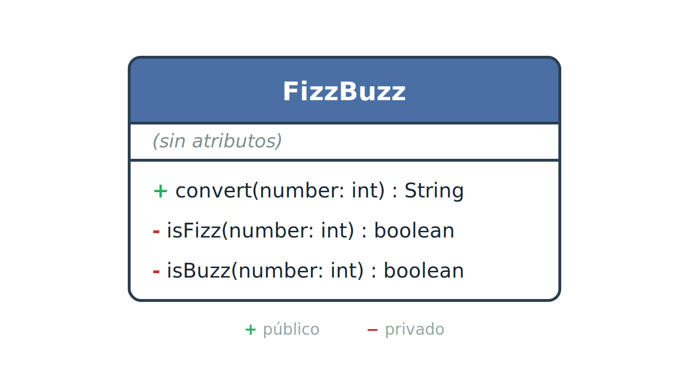
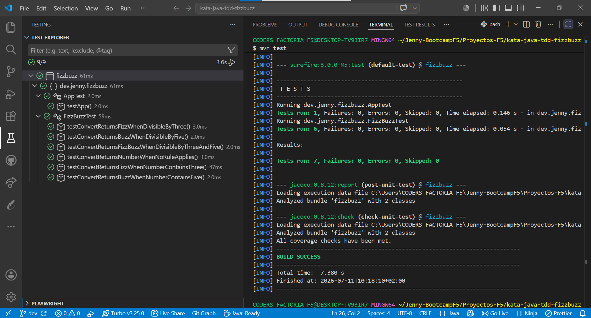
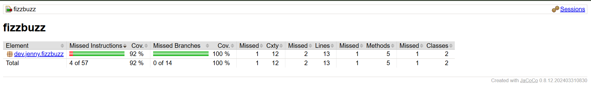
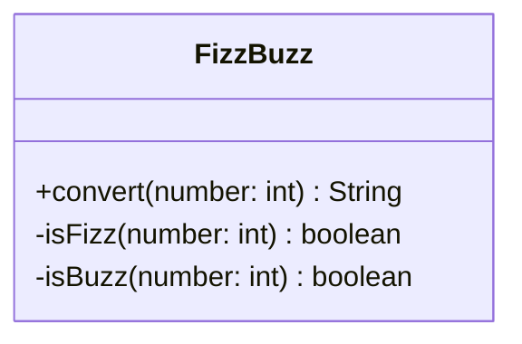

# 🔢 Kata FizzBuzz – Java con TDD

> Ejercicio de la kata FizzBuzz implementada en **Java 21 con Maven**, desarrollada siguiendo la metodología **TDD (Test-Driven Development)** con **JUnit 5** y con cobertura de tests medida con **JaCoCo**.

---

## 📸 Vista previa

|                  Diagrama de clase (UML)                  |              Tests (JUnit 5)              |               Cobertura (JaCoCo)               |
| :-------------------------------------------------------: | :---------------------------------------: | :--------------------------------------------: |
|  |  |  |

---

## 📑 Índice

- [Descripción](#-descripción)
- [Enunciado](#-enunciado)
- [Diagrama de clase](#-diagrama-de-clase)
- [Testing](#-testing)
- [Cobertura de tests](#-cobertura-de-tests-coverage)
- [Cómo reproducir el proyecto](#-cómo-reproducir-el-proyecto)
- [Estructura del repositorio](#-estructura-del-repositorio)
- [Tecnologías](#-tecnologías)
- [Recursos](#-recursos)
- [Autora](#-autora)

---

## 📋 Descripción

El objetivo de este proyecto es implementar la clásica kata **FizzBuzz** en Java, aplicando **TDD (Test-Driven Development)**. El ciclo consiste en:

- 🔴 **Red** — escribir primero un test que falla.
- 🟢 **Green** — escribir el código mínimo para que ese test pase.
- 🔵 **Refactor** — limpiar el código sin romper los tests.

Los requisitos principales son:

1. **Implementar la clase `FizzBuzz`** con la lógica del enunciado (Etapa 1 y Etapa 2).
2. **Testear la clase** de forma completa, cubriendo todos los escenarios.
3. **Insertar un diagrama de clase** de `FizzBuzz` en el README.
4. **Insertar una captura de la cobertura de tests** (coverage) en el README.

---

## 📝 Enunciado

Escribe un programa que imprima los números del 1 al 100 aplicando las siguientes normas:

### Etapa 1

- Devuelve `Fizz` si el número es divisible por 3.
- Devuelve `Buzz` si el número es divisible por 5.
- Devuelve `FizzBuzz` si el número es divisible por 3 y por 5.
- Devuelve el mismo número si no se cumple ninguna de las reglas anteriores.

### Etapa 2

- Devuelve `Fizz` si el número es divisible por 3 **o** si contiene un 3 (ej.: `Fizz` si el número es 534).
- Devuelve `Buzz` si el número es divisible por 5 **o** si contiene un 5 (ej.: `Buzz` si el número es 25).

---

## 📐 Diagrama de clase

La clase `FizzBuzz` no tiene atributos y expone un único método público, `convert`, que recibe un número entero y devuelve el resultado según las reglas del enunciado. La lógica de comprobación se separa en dos métodos privados de apoyo, `isFizz` e `isBuzz`, para mejorar la legibilidad y la separación de responsabilidades.


<details>
<summary>Ver versión en Mermaid</summary>



</details>

---

## 🧪 Testing

Siguiendo la metodología **TDD (Red-Green-Refactor)**, la clase `FizzBuzz` se testea cubriendo todos los escenarios del enunciado:

| Test                                                    | Entrada | Resultado esperado |
| ------------------------------------------------------- | :-----: | :----------------: |
| `testConvertReturnsFizzWhenDivisibleByThree`            |    3    |        Fizz        |
| `testConvertReturnsBuzzWhenDivisibleByFive`             |    5    |        Buzz        |
| `testConvertReturnsFizzBuzzWhenDivisibleByThreeAndFive` |   15    |      FizzBuzz      |
| `testConvertReturnsNumberWhenNoRuleApplies`             |    7    |         7          |
| `testConvertReturnsFizzWhenNumberContainsThree`         |   13    |        Fizz        |
| `testConvertReturnsBuzzWhenNumberContainsFive`          |   52    |        Buzz        |


---

## 📊 Cobertura de tests (coverage)

Reporte generado con **JaCoCo** tras ejecutar `mvn test`. El informe HTML se encuentra en `target/site/jacoco/index.html`.


| Métrica          | Cobertura |
| ---------------- | :-------: |
| Instrucciones    |   100 %   |
| Ramas (branches) |   100 %   |

---

## 🚀 Cómo reproducir el proyecto

### Requisitos previos

- **[JDK 21](https://www.oracle.com/java/technologies/downloads/)** instalado
- **[Apache Maven](https://maven.apache.org/download.cgi)** instalado y en el `PATH`
- **[Git](https://git-scm.com/downloads)** para clonar el repositorio

### Pasos

```bash
# 1. Clonar el repositorio
git clone https://github.com/Jennydev-25/kata-java-tdd-fizzbuzz.git
cd kata-java-tdd-fizzbuzz

# 2. Ejecutar los tests (genera además el reporte de cobertura de JaCoCo)
mvn test
```

El reporte de cobertura se genera en `target/site/jacoco/index.html`, que puedes abrir en el navegador.

---

## 📁 Estructura del repositorio

```text
kata-java-tdd-fizzbuzz/
├── assets/
│   └── images/
│       ├── class-diagram-uml.png
│       ├── coverage-jacoco.png
│       └── test-explorer.png
├── src/
│   ├── main/java/dev/jenny/fizzbuzz/
│   │   ├── App.java
│   │   └── FizzBuzz.java
│   └── test/java/dev/jenny/fizzbuzz/
│       ├── AppTest.java
│       └── FizzBuzzTest.java
├── .gitignore
├── pom.xml
└── README.md
```

---

## 🛠️ Tecnologías

- **[Java 21](https://www.oracle.com/java/technologies/downloads/)** — Lenguaje de programación del proyecto
- **[Apache Maven](https://maven.apache.org/)** — Gestor de dependencias y construcción del proyecto
- **[JUnit 5](https://junit.org/junit5/)** — Framework de tests unitarios
- **[Hamcrest](https://hamcrest.org/)** — Librería de _matchers_ disponible como dependencia de test (incluida en la configuración base del proyecto)
- **[JaCoCo](https://www.jacoco.org/jacoco/)** — Medición de la cobertura de tests
- **[Visual Studio Code](https://code.visualstudio.com/)** — Editor usado para desarrollar y gestionar el proyecto
- **[Markdown](https://www.markdownguide.org/)** — Lenguaje de marcado para el README
- **[Mermaid](https://mermaid.js.org/)** — Herramienta para crear diagramas mediante sintaxis basada en texto integrada en el README
- **[Git](https://git-scm.com/)** / **[GitHub](https://github.com/)** — Control de versiones y alojamiento del proyecto

---

## 📚 Recursos

- **[The FizzBuzz Kata](https://codingdojo.org/kata/FizzBuzz/)** — Descripción original de la kata en Coding Dojo
- **[JUnit 5 User Guide](https://junit.org/junit5/docs/current/user-guide/)** — Documentación oficial de JUnit 5
- **[JaCoCo Maven Plugin](https://www.jacoco.org/jacoco/trunk/doc/maven.html)** — Documentación del plugin de cobertura
- **[Test-Driven Development (Martin Fowler)](https://martinfowler.com/bliki/TestDrivenDevelopment.html)** — Introducción al ciclo Red-Green-Refactor
- **[Mermaid – Class Diagrams](https://mermaid.js.org/syntax/classDiagram.html)** — Documentación de Mermaid para diagramas de clase

---

## 👩‍💻 Autora

**[Jenny Sánchez Requejo](https://github.com/Jennydev-25)**
